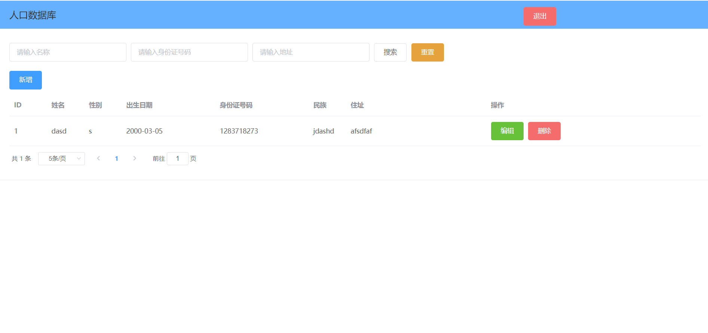

# 数据库管理系统
- 1、包含前端和后端，可以实现基本的增删改查工作和条件搜索，通过SQL语句具体实现
- 2、使用element-ui作为基本样式
- 3、具备简单的登录校验
## 使用说明
- 1、首先建立名为summerproject的数据库
- 2、在vuepart中运行``npm install``
- 3、首先运行spring boot，再运行``npm serve``
## 展示

